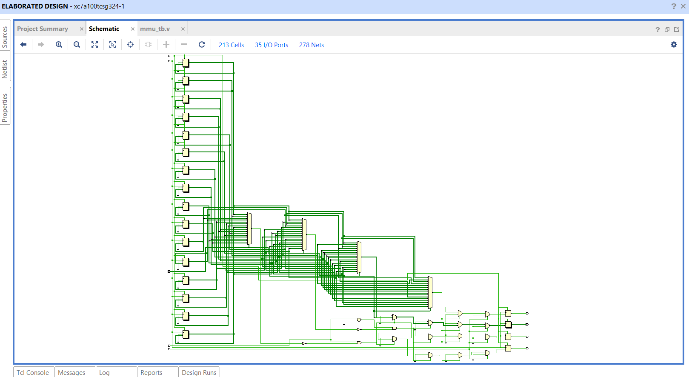
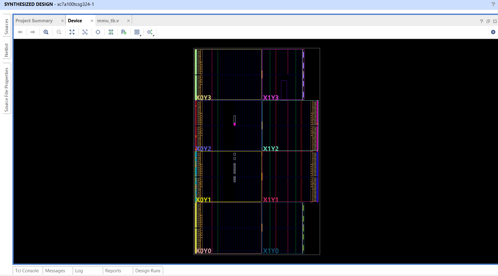
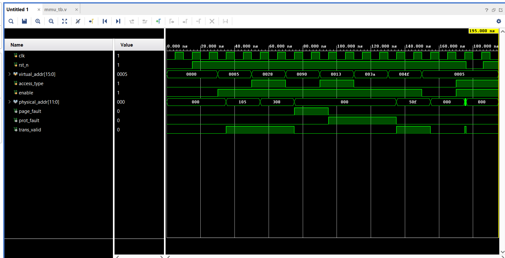
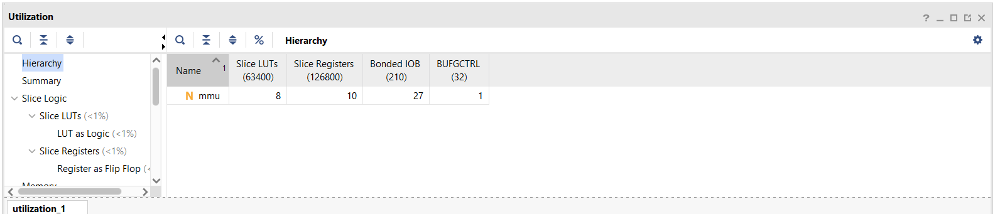
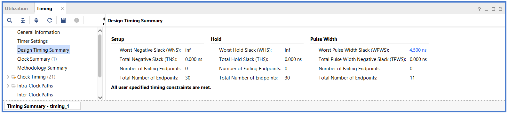

# 🧠 Memory Management Unit (MMU) Design using Verilog HDL

> A synthesisable, simulation-verified MMU implementing virtual-to-physical address translation with page-fault and protection-fault detection — built as a VLSI course project.

[](https://en.wikipedia.org/wiki/Verilog)
[](http://iverilog.icarus.com/)
[](https://www.xilinx.com/products/design-tools/vivado.html)
[](LICENSE)

---

## 📌 Problem Statement

Modern processors use **virtual memory** — every process believes it owns the full address space. But physical RAM is shared, limited, and must be protected. Without hardware-level translation and protection, one process could corrupt another's data or access kernel memory.

The **MMU solves this** by translating virtual addresses to physical addresses on every memory access, while enforcing access permissions and raising faults on violations.

---

## 🏗️ MMU Architecture

```
Virtual Address [15:0]
    ┌──────────────┬──────────┐
    │  VPN [15:4]  │ OFF[3:0] │
    └──────┬───────┴──────────┘
           │
           ▼
    ┌──────────────────┐
    │   Page Table     │  16 entries × 11 bits
    │   (Registers)    │  indexed by VPN
    └──────┬───────────┘
           │
    {valid, read, write, frame[7:0]}
           │
    ┌──────▼──────────────────────────┐
    │  valid==0? ──► PAGE_FAULT       │
    │  perm fail? ──► PROT_FAULT      │
    │  else ──► PA={frame, offset}    │
    │            TRANS_VALID=1        │
    └─────────────────────────────────┘
```

---

## 📐 Design Specification

| Parameter | Value |
|---|---|
| Virtual Address Width | 16 bits |
| Physical Address Width | 12 bits |
| Page Size | 16 bytes (4-bit offset) |
| Virtual Page Number | VA[15:4] — 12 bits |
| Page Table Entries | 16 |
| PTE Width | 11 bits {valid, R, W, frame[7:0]} |

### Address Breakdown

```
Virtual Address [15:0]:
  ┌────────────────────────┬──────────┐
  │    VPN  [15:4]  12b    │ OFF [3:0]│
  └────────────────────────┴──────────┘

Physical Address [11:0]:
  ┌────────────────┬──────────┐
  │  Frame [11:4]  │ OFF [3:0]│
  └────────────────┴──────────┘
```

### Page Table (loaded at reset)

| VPN | Valid | Read | Write | Frame | Access |
|-----|-------|------|-------|-------|--------|
| 0 | ✅ | ✅ | ✅ | 0x10 | Full |
| 1 | ✅ | ✅ | ❌ | 0x20 | Read-only |
| 2 | ✅ | ✅ | ✅ | 0x30 | Full |
| 3 | ✅ | ❌ | ✅ | 0x40 | Write-only |
| 4 | ✅ | ✅ | ✅ | 0x50 | Full |
| 5–15 | ❌ | — | — | — | INVALID |

---

## 🗂️ Folder Structure

```
MMU-Design-Verilog-HDL/
│
├── rtl/
│   └── mmu.v              ← Parameterised MMU RTL
│
├── tb/
│   └── mmu_tb.v           ← 8-case testbench
│
├── constraints/
│   └── nexys_a7.xdc       ← Vivado FPGA constraints (Nexys A7-100T)
│
├── simulation/
│   └── run_sim.sh         ← One-click Icarus Verilog simulation script
│
├── waveforms/             ← (Save GTKWave screenshots here)
│
├── reports/               ← (Save Vivado synthesis reports here)
│
├── images/                ← (Architecture diagrams, screenshots)
│
├── docs/
│   ├── project_report.md  ← Full technical report
│   └── interview_prep.md  ← 10 Q&A for interviews
│
├── README.md
└── .gitignore
```

---

## 🧰 Tools Used

| Tool | Purpose | Cost |
|---|---|---|
| Icarus Verilog | RTL simulation | Free |
| GTKWave | Waveform viewing | Free |
| EDA Playground | Online simulation (no install) | Free |
| Xilinx Vivado | Synthesis + FPGA implementation | Free (WebPACK) |

---

## ⚡ How to Simulate (Icarus Verilog)

**Install:**
```bash
sudo apt install iverilog gtkwave        # Ubuntu/Debian
brew install icarus-verilog gtkwave      # macOS
```

**Run:**
```bash
git clone https://github.com/YOUR_USERNAME/MMU-Design-Verilog-HDL.git
cd MMU-Design-Verilog-HDL

iverilog -o simulation/mmu_sim.out rtl/mmu.v tb/mmu_tb.v
vvp simulation/mmu_sim.out
gtkwave simulation/mmu_wave.vcd
```

Or use the one-liner script:
```bash
bash simulation/run_sim.sh
```

---

## 🌐 Online Simulation (No Install)

1. Go to [https://www.edaplayground.com](https://www.edaplayground.com)
2. Select **Icarus Verilog 12.0**
3. Paste `rtl/mmu.v` in the Design pane
4. Paste `tb/mmu_tb.v` in the Testbench pane
5. Enable **EPWave** for waveform view
6. Click **Run**

---

## ✅ Testbench Results

```
TC1: VA=0x0005  VPN=0  READ   → PA=0x105  trans_valid=1  ✓
TC2: VA=0x0028  VPN=2  WRITE  → PA=0x308  trans_valid=1  ✓
TC3: VA=0x0090  VPN=9  READ   → page_fault=1             ✓
TC4: VA=0x0013  VPN=1  WRITE  → prot_fault=1 (R-only)   ✓
TC5: VA=0x003A  VPN=3  READ   → prot_fault=1 (W-only)   ✓
TC6: VA=0x004F  VPN=4  READ   → PA=0x50F  trans_valid=1  ✓
TC7: enable=0          READ   → all outputs = 0          ✓
TC8: Mid-run reset             → all outputs cleared      ✓
```

---

## 📊 Waveform Signals to Monitor

Add these signals in GTKWave:

| Signal | Description |
|---|---|
| `clk` | Clock |
| `rst_n` | Active-low reset |
| `virtual_addr[15:0]` | Input virtual address |
| `access_type` | 0=READ, 1=WRITE |
| `enable` | Translation enable |
| `physical_addr[11:0]` | Output physical address |
| `trans_valid` | Translation succeeded |
| `page_fault` | Page not present |
| `prot_fault` | Permission violation |

---

## 🔌 FPGA Implementation (Nexys A7-100T)

| FPGA Resource | Mapping |
|---|---|
| SW[7:0] | virtual_addr[7:0] |
| SW15 | access_type |
| SW14 | enable |
| LD[7:0] | physical_addr[7:0] |
| LD8 | trans_valid |
| LD9 | page_fault |
| LD10 | prot_fault |
| BTN0 | rst_n |

---

## 🖼️ Project Screenshots

### Elaborated Design (RTL Schematic)
213 cells, 35 I/O ports, 278 nets — generated from `mmu.v` before synthesis optimization.



### Device View (Post-Synthesis Placement)
Artix-7 xc7a100tcsg324-1 — small footprint, design occupies a handful of slices near the die center.



### Full Simulation Waveform
All 8 test cases visible after Zoom Fit — VA/PA transitions, page_fault and prot_fault pulses clearly marked.



### Utilization Report


### Timing Summary


---

## 📈 Synthesis & Implementation Results (Vivado 2024.2, Artix-7 xc7a100tcsg324-1)

Actual results from synthesis + implementation on Vivado 2024.2:

| Resource | Used | Available | % |
|---|---|---|---|
| Slice LUTs | 8 | 63,400 | <1% |
| Slice Registers | 10 | 126,800 | <1% |
| Bonded IOB | 27 | 210 | ~13% |
| BUFGCTRL | 1 | 32 | ~3% |
| BRAM | 0 | — | 0% |

**Timing (Design Timing Summary):**

| | Setup | Hold | Pulse Width |
|---|---|---|---|
| Worst Slack | inf | inf | 4.500 ns |
| Failing Endpoints | 0 / 30 | 0 / 30 | 0 / 11 |

✅ **All user specified timing constraints are met.**

**Bitstream:** Successfully generated (with one DRC note below).

> **Note on DRC UCIO-1:** `physical_addr` is 12 bits, but the included `nexys_a7.xdc` only maps the lower 8 bits to LEDs (`physical_addr[7:0]`) — a Nexys A7 doesn't have 12 spare single-color LEDs in this simple mapping scheme. This causes a `DRC UCIO-1: Unconstrained Logical Port` error on `physical_addr[11:8]` during bitstream generation. This is resolved by downgrading the check to a warning via a pre-hook Tcl script (see `docs/vivado_guide.md` → Step 12 for the exact commands) — it is a deliberate constraints simplification, not an RTL bug.

---

## 📸 Screenshots Checklist

- [x] RTL code in editor
- [x] Testbench code in editor
- [x] Simulation compile output (no errors)
- [x] TC1 waveform — valid READ translation
- [x] TC3 waveform — page_fault asserted
- [x] TC4 waveform — prot_fault asserted
- [x] GTKWave / Vivado full waveform view
- [x] Elaborated design schematic (213 cells, 35 I/O, 278 nets)
- [x] Vivado device view (post-synthesis placement)
- [x] Vivado synthesis utilization report
- [x] Vivado timing summary (Slack ≥ 0 — actually inf)
- [x] Bitstream generated successfully
- [ ] GitHub repository preview

---

## 🚀 Future Improvements

- [ ] TLB (Translation Lookaside Buffer) — cache recent translations
- [ ] 2-level page table for larger address spaces
- [ ] Execute permission bit (XN/NX for security)
- [ ] User vs Kernel privilege levels
- [ ] AXI4-Lite bus interface for register-mapped page table
- [ ] Page replacement policy simulation

---

## 🎓 Learning Outcomes

After completing this project you will understand:
- Virtual memory and address translation fundamentals
- Page table design and implementation in hardware
- Verilog RTL coding: parameterised modules, register arrays, sequential logic
- Testbench design and structured test case methodology
- FPGA synthesis flow and constraint-driven implementation
- VLSI interview topics: MMU, TLB, page fault, memory protection

---

## 📚 References

- Patterson & Hennessy — *Computer Organization and Design*
- ARM Architecture Reference Manual — Memory Management
- IEEE Std 1364-2001 — Verilog Hardware Description Language


## Author

**Seshu** | VLSI Design Portfolio | GitHub: [@Github](https://github.com/seshu-8)

Linkedin:[@Linkedin](https://www.linkedin.com/in/seshu-babu-konijeti-74968b2b9?utm_source=share_via&utm_content=profile&utm_medium=member_android)


---

*Built as a VLSI course project. Simulation-verified. GitHub-ready.*
